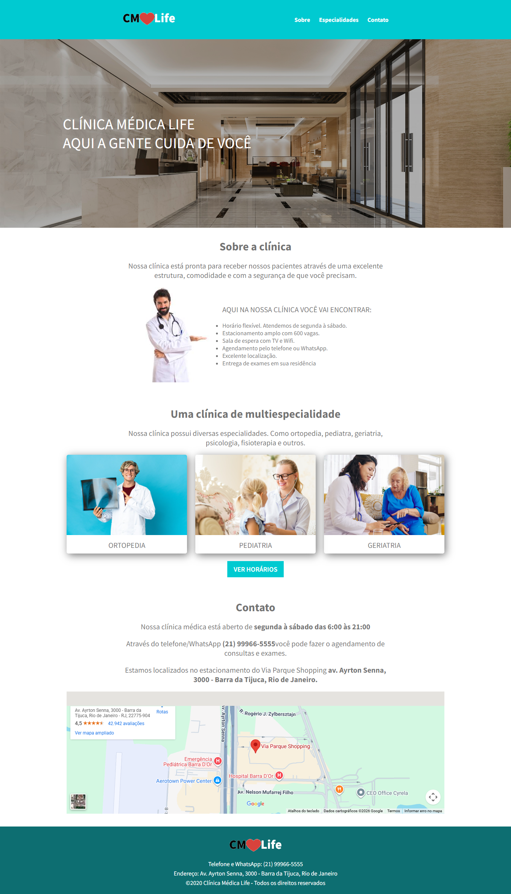
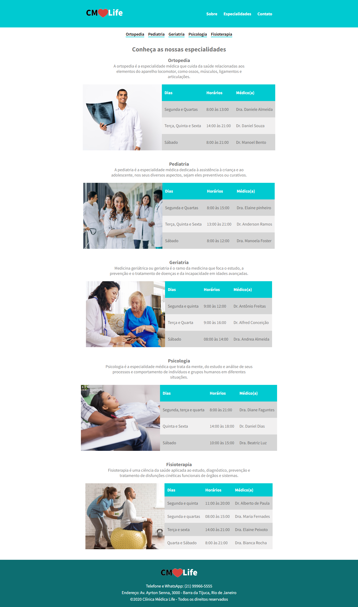

# 🏥 CMLife – Clínica Médica (Site Responsivo)

Projeto desenvolvido como parte dos estudos em **HTML5 e CSS3**, com foco na **criação de páginas responsivas** utilizando **Media Queries**, garantindo uma boa experiência de uso em dispositivos móveis, tablets e desktops.

---

## 🧩 Sobre o projeto

O **CMLife** é um site institucional de uma clínica médica fictícia, composto por duas páginas principais:

- **Página inicial (Home)**  
- **Página de especialidades**

O objetivo do projeto é aplicar conceitos de **layout flexível**, **responsividade** e **organização visual**, adaptando os elementos da interface conforme o tamanho da tela do usuário.

---

## 📱 Responsividade com Media Queries

A responsividade do site foi implementada utilizando **Media Queries no CSS**, permitindo ajustes específicos para diferentes larguras de tela.

Foram considerados quatro principais cenários:

- 📱 **Dispositivos móveis (320px – 425px)**
- 📲 **Tablets (426px – 768px)**
- 💻 **Notebooks (até 1024px)**
- 🖥️ **Desktops (acima de 1025px)**

---

## 🎯 Estratégias de Media Queries

### 📱 Mobile (320px a 425px)

Nesta faixa, o layout foi otimizado para telas pequenas:

- 🔽 Menu superior reorganizado em coluna  
- 🖼️ Imagens decorativas ocultadas para melhorar a leitura  
- 🧱 Galeria de especialidades exibida em coluna  
- 🔠 Redução do tamanho das fontes  
- 🗺️ Mapa ajustado para ocupar toda a largura da tela

### 📲 Tablets (426px a 768px)

Para telas intermediárias, foram aplicados ajustes para manter equilíbrio visual:

- 📐 Galeria com quebra de linha (flex-wrap)
- 🖼️ Ocultação das imagens laterais nas especialidades
- 🔠 Redução sutil do tamanho do texto

## 🖥️ Tecnologias utilizadas

- HTML5  
- CSS3  

---

## 📸 Demonstração do projeto
### 🔗 Página Inicial

### 🩺 Página de Especialidades

